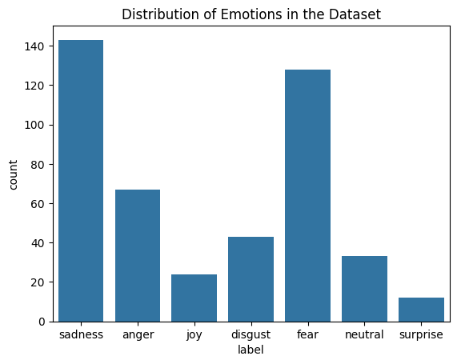
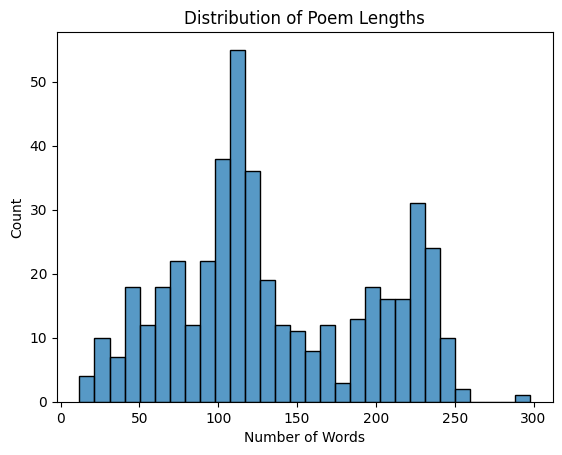
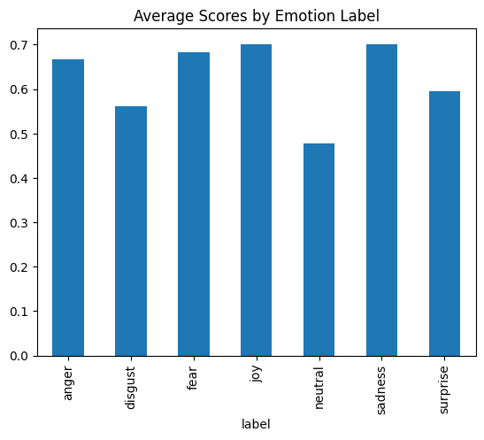

# 2024_IA653_Kranthi_Shylendra
Final Project of Kranthi Chaithanya Thota and Shylendra Bangaru for IA653

Under the guidance of professor Michael Gilbert (mgilbert@clarkson.edu) and GA Nisar Ahamad Killedar (killedn@clarkson.edu)

# Developing NLP Models to build an emotion based AI poetry generator

This repository contains code of different NLP models that can generate poetry based on a particular emotion. Various machine learning, deep learning and transformer models are leveraged in the code to try and test their performances based on the required output.

## Table of Contents
- [Introduction](#introduction)
- [Dataset](#dataset)
- [Preprocessing](#preprocessing)
- [Model Selection](#model-selection)
- [Evaluation and Results](#evaluation-and-results)
- [Usage](#usage)
- [Dependencies](#dependencies)

## Introduction

This project explores the intersection of natural language processing and emotional sentiment analysis by focusing on poetry. The primary goal is to analyze poetic content, classify it into predefined emotion categories, and generate new poetic lines conditioned on specific emotions.

Key features include:

Emotion classification using traditional machine learning models like Naive Bayes.
Poetic text generation using advanced deep learning models, including RNNs, LSTMs, and Transformers (GPT-2).
Insights into the structure and patterns of emotions in poetry through exploratory data analysis.

## Dataset

### Overview of the Dataset
The dataset for this project is sourced from the HuggingFace library and contains a collection of poems annotated with emotion labels. Each entry in the dataset represents a poem, along with its corresponding emotion and metadata.

### Key Features:

**Size** : 450 records.

**Themes** : Includes "Renaissance," "Mythology & Folklore," etc.

**Dominant Emotions** : Analyzed through specific columns (anger, joy, sadness, etc.).

**Score** : Confidence levels of the predicted emotion.

**Metadata** : Includes thematic and temporal attributes, such as the poem's era (age) and its type (type).

For this project the focus was mainly limited to the dominant emotions of each poem.

### Data Dictionary

| Column         | Description                     | Data Type  |
| -------------- | -------------------------------- | ---------- |
| `poem_content` | Text of the poem                 | Object     |
| `pred`         | Predicted emotion category ID    | Integer    |
| `label`        | True emotion label               | Object     |
| `score`        | Confidence score of prediction   | Float      |
| `anger, joy, ...` | Scores for specific emotions  | Float      |
| `age`          | Era of the poem                  | Object     |
| `type`         | Thematic category                | Object     |

## Exploratory Data Analysis (EDA)

1. **Emotion Distribution**: Visualized using a count plot to understand the frequency of each emotion label. This helps identify any class imbalance or trends in emotional representation.

2. **Poem Lengths**: Analyzed with a histogram to observe the distribution of word counts across poems. 

3. **Average Scores**: Examined via a bar chart to compare the mean confidence scores for each emotion label.

##  Preprocessing

1. **Text Cleaning**:  
   - Converted text to lowercase.  
   - Removed special characters, punctuation, and extra whitespace.  

2. **Tokenization**:  
   - Extracted word-level tokens using spaCy's language model.  

3. **Feature Engineering**:  
   - Added `poem_length` as a feature based on word count.

## Model Selection

We've tried out 5 different models i:e Naive Bayes , N-gram, RNN, LSTM, Transformer models for our current objective. These models collectively enable both classification and generation tasks, leveraging statistical, sequential, and attention-based approaches for diverse NLP capabilities.

### Naive Bayes Model for Text Classification: 

The Naive Bayes Model in this script is used for text classification to predict the emotion labels of poems. We've used the `CountVectorizer` to transform the cleaned text into a bag-of-words representation, restricting the vocabulary to the top 5000 features (`max_features=5000`). The data is then split into training and testing sets using an `80-20` ratio. The `MultinomialNB` model is trained on the transformed features (`X_train`) and corresponding labels (`y_train`). Predictions on the test set are evaluated using a classification report, providing metrics like precision, recall, and F1-score. 

### N-Gram Model for Text Generation: 

The N-Gram Model generates poetic text by learning word patterns in the dataset. Here, a trigram model (`n=3`) is trained on poems filtered by a specific emotion, creating a probabilistic mapping between sequences of three words (n-1) and their next possible word. The `generate_poetic_text` function uses this model to create new text based on a given seed text and specified word count. The seed text initializes the sequence, and subsequent words are sampled probabilistically from the n-gram distribution. 

### RNN (Recurrent Neural Network) and LSTM (Long Short-Term Memory) for Text Generation: 

The RNN (Recurrent Neural Network) and LSTM (Long Short-Term Memory) models are neural architectures designed to handle sequential data like text. Both models map input sequences (tokenized words) to an embedding space (`embed_size=128`) and process them using hidden layers (`hidden_size=256`). The LSTM model incorporates gating mechanisms to manage long-term dependencies, addressing the vanishing gradient problem inherent in RNNs. Both models predict the next word in a sequence, enabling poetic text generation. The `generate_text` function takes a seed text, generates indices using the trained model, and reconstructs the sequence into words using a vocabulary mapping. These models are more adept than n-grams at capturing global text structure and context.

### Transformer (GPT-2) for Text Generation: 

The Transformer-based GPT-2 Model is fine-tuned for generating poetry conditioned on emotions. It uses the GPT-2 tokenizer and model, augmented with special tokens (`<bos>`, `<eos>`, and `<pad>`). The dataset is formatted into sequences combining emotion labels and poems, and the `TextDataset` prepares these for training. A `DataCollatorForLanguageModeling` ensures token alignment during batching. Fine-tuning occurs with hyperparameters such as a batch size of 4, a learning rate of `5e-5`, and 5 epochs, using the `Trainer` API. The `generate_poem` function creates emotion-specific poems by feeding a seed text and emotion into the trained model. GPT-2 excels at generating coherent and contextually relevant text due to its attention mechanism and large-scale pretraining.

## Evaluation and Results

There are no defined metrics for evaluation in this project. The models are coded to generate a poetic text based on the input string, number of output words, emotion context.

Below given are the poetry generated by all the afore-mentioned models. All of them were given an input string `the moon is beautiful` with a required number of words as 20 and different emotions in each model.

### N-Gram Model

**Emotion** : `sadness`

**Generated Poem** : the moon thy wishes then dare not be with you through the sweet bitter under this marble figure with wings

**Emotion** : `joy`

**Generated Poem** : the moon light her hubby dear loves to live i the sun seeking the food he eats and pleased with

### RNN Model

**Emotion** : `sadness`

**Generated Poem** : the moon is beautiful husband twisted fedde bough lucks desires honeybee worst strength saints cyclones ii cythera dirt difficult swallows

**Emotion** : `joy`

**Generated Poem** : the moon is beautiful life running fallen art gifts suffice brief souls twinkling cheer wish fall know in what circes

### LSTM Model

**Emotion** : `sadness`

**Generated Poem** : the moon is beautiful gyb subdue mutual sweated anthem hearts print pelides tyrant expense others grief faynting delight growth dazzle

**Emotion** : `joy`

**Generated Poem** : the moon is beautiful first springs sake was springs sake was springs sake was springs sake was springs sake was

### Transformer Model (GPT-2)

**Emotion** : `sadness`

**Generated Poem** : the moon is beautiful And the stars are bright and clear And the moon is full of love

**Emotion** : `joy`

**Generated Poem** : the moon is beautiful, And the stars are bright, And the moon is full of light. 

Based on the above given outputs, The Transformer model (GPT-2) stands out among the other models in generating coherent and emotion contextual poems. The LSTM model shows potential in capturing complex word patterns, though it struggles with coherence. The RNN and N-Gram models are less effective in maintaining coherence and emotional relevance, often producing more disjointed and less meaningful text.

## Usage

### Steps to Run:
1. Clone the repository.
2. Install the required dependencies.
3. Load the dataset.
4. Run the preprocessing steps.
5. Train the models.
6. Evaluate the models.

## Dependencies

List of dependencies required to run the project:

- pandas
- numpy
- scikit-learn
- keras
- keras-preprocessing
- nltk
- tensorflow
- pytorch
